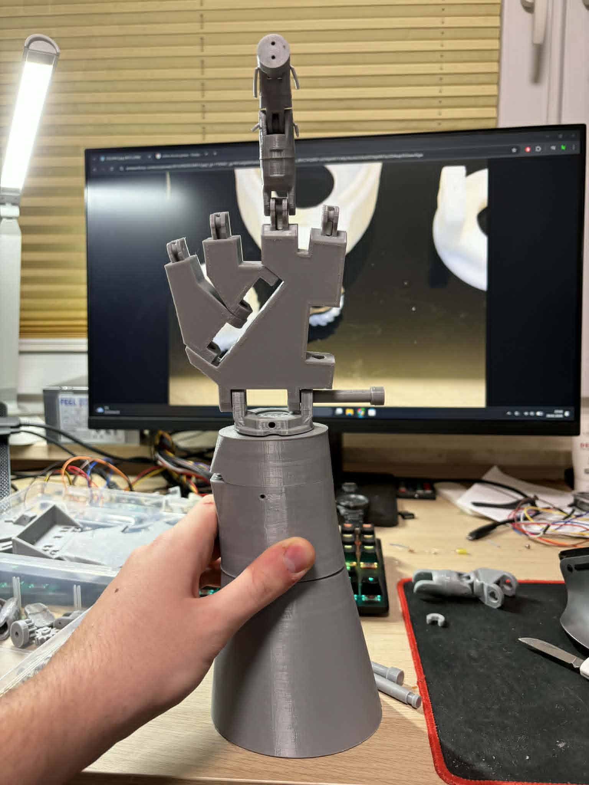
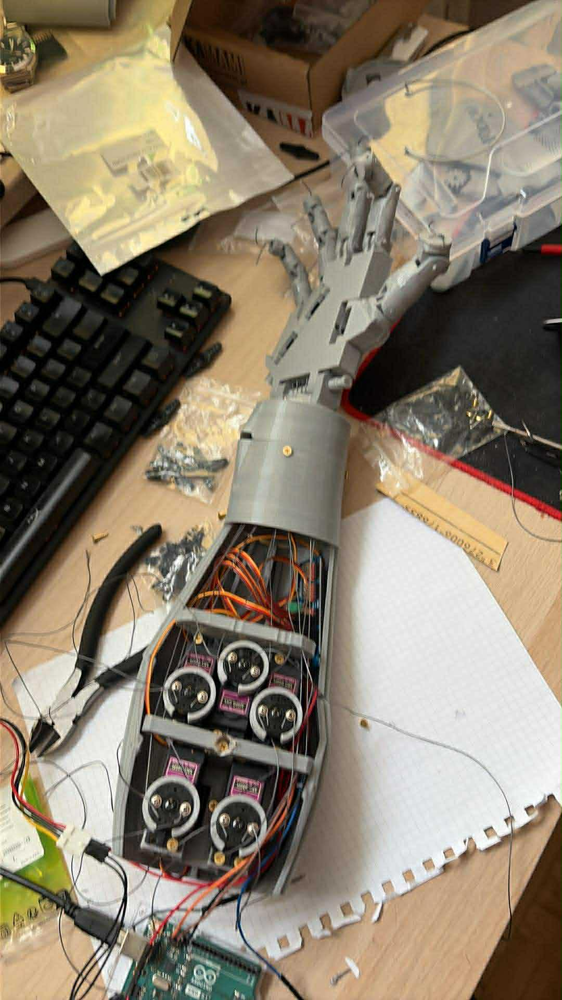

# 🤖 Smart Robotic Hand Controller

<div align="center">

# 🦾 AI-Powered Robotic Hand Control System

### Real-Time Hand Tracking & Physical Robotic Hand Manipulation using Computer Vision, LabVIEW and Arduino

<br>

[](https://github.com/MatysiakQ/Hand-Tracking-Control-System)
[](https://www.python.org/)
[](https://opencv.org/)
[](https://developers.google.com/mediapipe)
[](https://www.ni.com/labview/)
[](https://www.arduino.cc/)
[](https://github.com/MatysiakQ/Hand-Tracking-Control-System)

<br>
</div>

---

# 📌 Project Overview

**Smart Robotic Hand Controller** is an advanced real-time robotic control system combining:

- 🤖 Robotics
- 👁️ Computer Vision
- 🧠 AI-Based Hand Tracking
- ⚡ Real-Time Signal Processing
- 🔌 Embedded Systems
- 📡 Hardware Communication

The system captures live camera input, detects hand landmarks using **MediaPipe + OpenCV**, processes finger movement and wrist rotation, and maps those motions directly onto a physical robotic hand controlled by **Arduino** and **LabVIEW**.

The project demonstrates full integration between software AI systems and real-world hardware control.

---

# 🎥 Project Demo

## 📹 Hand Tracking Demonstration

> Real-time AI hand tracking controlling a physical robotic manipulator.

```text
/video/Hand_Tracking.mp4
```

---

# 📸 Project Photos

## 🔧 Work In Progress



---

## 🦾 Internal Robotic Hand Mechanism



---

# 🧠 System Architecture

```text
Camera Input
     ↓
OpenCV + MediaPipe
     ↓
21 Hand Landmark Detection
     ↓
Finger Angle Calculation
     ↓
UDP Communication (Port 5010)
     ↓
LabVIEW Control System
     ↓
Arduino + LINX Toolkit
     ↓
PWM Servo Control
     ↓
Physical Robotic Hand
```

---

# ✨ Core Features

## ✋ Real-Time Hand Tracking

- Detection of **21 hand landmarks**
- Finger bending analysis
- Wrist yaw rotation tracking
- Live gesture interpretation
- Real-time coordinate processing

---

## ⚡ Low-Latency UDP Communication

The system uses UDP socket communication for ultra-fast data transmission between the AI vision module and the hardware control layer.

- Real-time synchronization
- Low latency communication
- Port: `5010`
- Stable live data streaming

---

## 🎛️ Signal Stabilization & Filtering

To eliminate jitter and unstable servo movement, the project implements advanced filtering mechanisms:

- EMA Filter *(Exponential Moving Average)*
- Median Filtering
- Motion smoothing algorithms

This significantly improves movement precision and robotic stability.

---

## 🦾 Robotic Hand Control

The robotic hand mirrors real human hand movement through:

- Servo motor actuation
- PWM signal generation
- Real-time angle mapping
- Hardware-level motion control

---

## 🧩 Gesture Recognition

The system supports gesture identification using unique gesture states and IDs.

This enables:
- predefined movement sequences
- automation logic
- future AI interaction extensions

---

# 📐 Angle to Servo Mapping

Servo signals are generated using the following formula:

$$
DutyCycle = \left(\frac{Angle}{3600}\right) + 0.05
$$

This allows smooth and safe conversion between detected hand angles and PWM control signals.

---

# 🛠️ Tech Stack

## 💻 Software

| Technology | Purpose |
|---|---|
| Python 3.x | Core AI & tracking logic |
| OpenCV | Image processing |
| MediaPipe | Hand landmark detection |
| LabVIEW 2025 | Hardware control & GUI |
| LINX Toolkit | Arduino communication |

---

## 🔩 Hardware

| Hardware | Purpose |
|---|---|
| Arduino | Servo control |
| Servo Motors | Finger movement |
| USB Camera | Hand tracking input |
| Robotic Hand Mechanism | Physical manipulator |

---

# 🚀 How To Run

## 1️⃣ Upload LINX Firmware

Flash LINX firmware onto the Arduino board using LabVIEW.

---

## 2️⃣ Start AI Tracking Module

Run:

```bash
main.py
```

inside the:

```text
/Kod
```

directory.

This initializes:
- webcam capture
- MediaPipe hand tracking
- UDP data transmission

---

## 3️⃣ Launch LabVIEW Controller

Open:

```text
arduinoTest.vi
```

Then:
- select COM port
- connect Arduino
- run the VI

The robotic hand should now respond to live hand movement.

---

# 📂 Repository Structure

```text
📦 Hand-Tracking-Control-System
 ┣ 📂 Kod
 ┃ ┣ 📜 main.py
 ┃ ┗ 📜 arduinoTest.vi
 ┣ 📂 Photo
 ┃ ┣ 📸 Hand_Inside.jpg
 ┃ ┗ 📸 Work_in_Progress.jpg
 ┣ 📂 video
 ┃ ┗ 🎥 Hand_Tracking.mp4
 ┣ 📂 REKA ROBOTA
 ┣ 📂 ADAPTER
 ┣ 📂 PRZEDRAMIE
 ┗ 📜 README.md
```

---

# 🎯 Key Engineering Concepts

This project demonstrates practical usage of:

- Computer Vision
- AI Gesture Recognition
- Real-Time Robotics
- Signal Filtering
- Embedded Systems
- Hardware Communication Protocols
- Human-Machine Interaction
- Servo Control Systems

---

# 👨‍💻 Authors

## Adam Jastrzębski
🔗 https://adamjastrzebski.bio/

## Łukasz Koszołko

---

# 📈 Future Improvements

Planned future upgrades:

- 🤖 Machine Learning gesture classification
- 🖐️ Multi-hand support
- 🎮 VR/AR integration
- 📡 Wireless communication
- 🦿 Additional robotic joints
- ☁️ Remote robotic control

---

# ⭐ Final Note

This project combines **Artificial Intelligence**, **Computer Vision**, and **Robotics Engineering** into a fully functional real-world control system capable of translating human movement into robotic interaction in real time.

It represents a practical implementation of modern human-machine interaction systems and embedded AI control.

---
